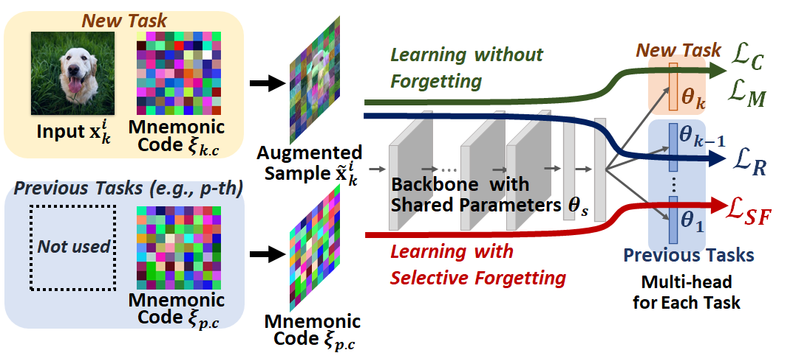

# Learning with Selective Forgetting (IJCAI21)

This is an official PyTorch impelementation of our paper  "[Learning with Selective Forgetting (IJCAI2021)](https://www.ijcai.org/proceedings/2021/0137.pdf)" 



## Getting Started: Generate Datasets and Mnemonic Code (CIFAR100 with Task2, Task5, Task10)
`sh ./gen_datasets.sh`

## Run Main Process (CIFAR100)
`sh ./cifarT2.sh` # CIFAR100 with Task2

`sh ./cifarT5.sh` # CIFAR100 with Task5

`sh ./cifarT10.sh` # CIFAR100 with Task10

## Citation
If you use this toolbox or benchmark in your research, please cite this project.

```
@inproceedings{shibata2021learning,
  title={Learning with Selective Forgetting.},
  author={Shibata, Takashi and Irie, Go and Ikami, Daiki and Mitsuzumi, Yu},
  booktitle={IJCAI},
  volume={2},
  number={4},
  pages={6},
  year={2021}
}
```
